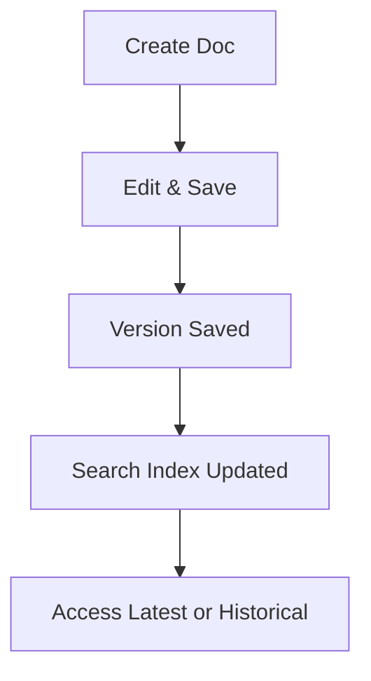

## Overview

Areeba Osama provides powerful tools to create, organize, collaborate on, and maintain your project documentation. You streamline your workflow with intuitive document creation, flexible folder structures, real-time team collaboration, and robust search with version control. These features ensure your docs stay current and accessible.

<Columns cols={2}>
  <Card title="Document Tools" icon="edit-3" href="#document-creation">
    Create and edit rich documents with markdown and MDX support.
  </Card>
  <Card title="Organization" icon="folder" href="#project-organization">
    Structure projects with nested folders and tags.
  </Card>
  <Card title="Collaboration" icon="users" href="#collaboration">
    Invite teams and review changes together.
  </Card>
  <Card title="Search & Versions" icon="search" href="#search-versions">
    Find content fast and track history.
  </Card>
</Columns>

## Document Creation and Editing Tools

Start new documents directly from the dashboard. You select templates for API docs, guides, or changelogs.

<Steps>
  <Step title="Create Document" icon="plus">
    Click the `New Document` button and choose a template.
  </Step>
  <Step title="Edit Content" icon="edit">
    Use the visual editor for markdown, or switch to code view for MDX.
  </Step>
  <Step title="Preview & Publish" icon="eye">
    Preview changes live, then publish to your site.
  </Step>
</Steps>

<Tabs>
  <Tab title="Markdown" icon="code">
    Write simple markdown for quick docs.

````markdown
# Welcome

This is your first document.

- List items
- With links: [Areeba Osama](https://docs.example.com)
````
  </Tab>
  <Tab title="MDX with Components" icon="components">
    Embed interactive components.

````mdx
<Callout kind="info">

This is an embedded callout.

</Callout>
````
  </Tab>
</Tabs>

<Callout kind="tip">
  Enable live preview to see changes instantly without publishing.
</Callout>

## Project Organization and Folder Structures

Organize docs hierarchically. Create folders for projects, subfolders for versions, and use tags for cross-referencing.

<CodeGroup tabs="Folder Structure,API Config">
```json
{
  "projects": {
    "api-docs": {
      "v1": ["endpoints.mdx", "auth.mdx"],
      "v2": ["endpoints.mdx"]
    },
    "user-guide": ["quickstart.mdx"]
  }
}
```

```javascript
// Example config for nested navigation
const nav = {
  "API Reference": "/api-docs",
  "User Guide": "/user-guide/quickstart"
};
```
</CodeGroup>

## Collaboration Features for Teams

Invite members with role-based access: viewer, editor, or admin. You review changes via comments and approve merges.

<Tabs>
  <Tab title="Invite Team" icon="user-plus">
    Share invite links or add by email.

    ```bash
    curl -X POST https://api.example.com/teams/invite \
      -H "Authorization: Bearer YOUR_TOKEN" \
      -d '{"email": "team@company.com", "role": "editor"}'
    ```
  </Tab>
  <Tab title="Review Changes" icon="git-branch">
    Use pull requests for docs updates.
  </Tab>
</Tabs>

<Expandable title="Advanced Permissions" default-open="false">
  Set granular permissions per folder, like edit-only for public docs.
</Expandable>

## Search and Version Control Basics

Search across all docs with full-text indexing. Track changes with automatic versioning.



<Callout kind="info">
  Versions retain full history. Revert to any point with one click.
</Callout>

Restore previous versions or compare diffs easily. This keeps your documentation reliable and auditable.